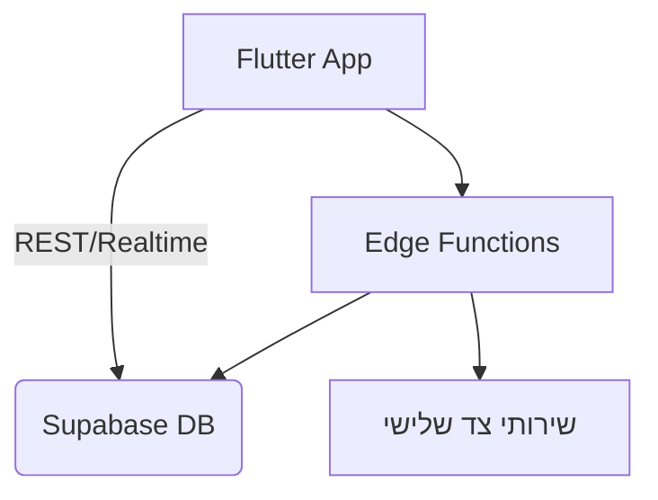

# ארכיטקטורה

המערכת מבוססת על Flutter עם Riverpod ו-GoRouter. צד השרת מבוסס על Supabase וכולל פונקציות Edge ב-Deno. להלן תרשים כללי:

```mermaid
graph TD;
  A[Flutter App] -->|REST/Realtime| B(Supabase DB)
  A --> C[Edge Functions]
  C --> B
  C --> D[שירותי צד שלישי]
```
